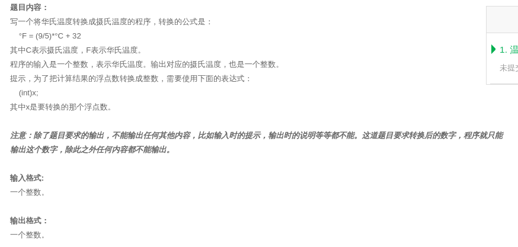
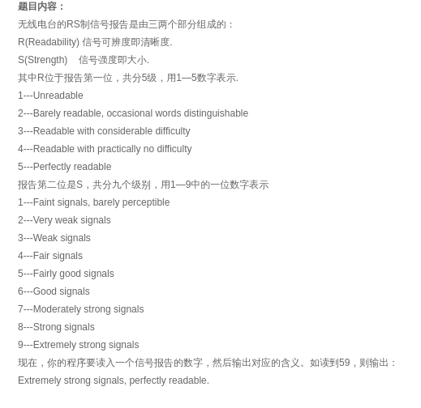
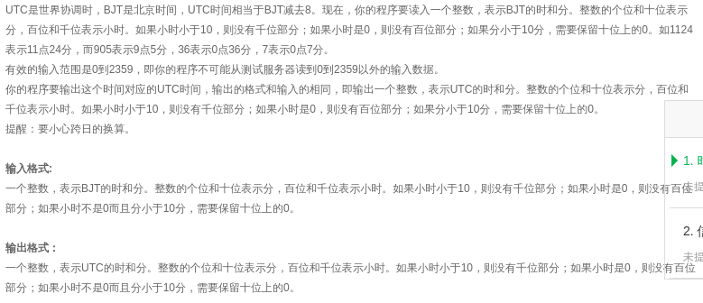
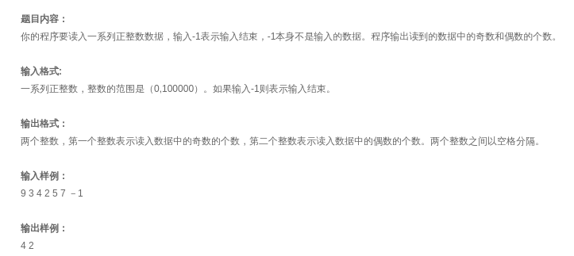
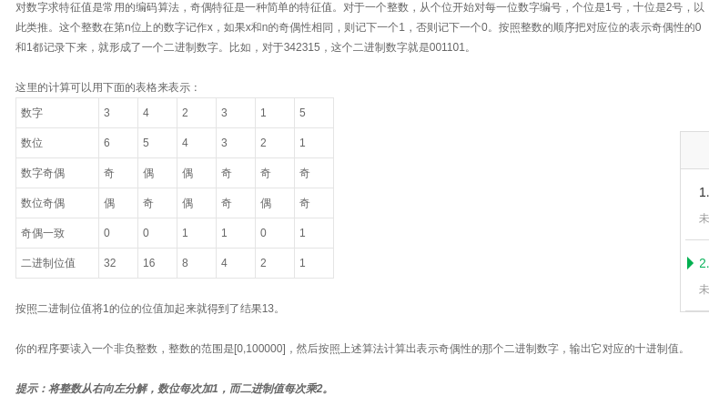
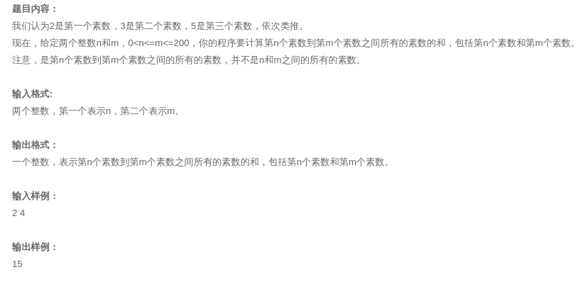
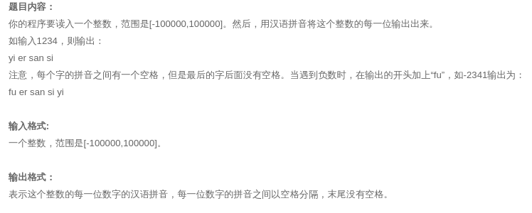
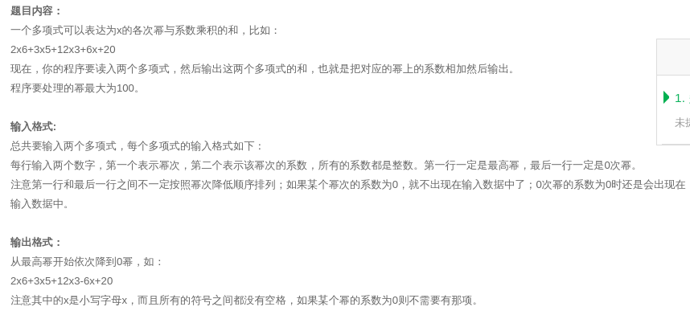
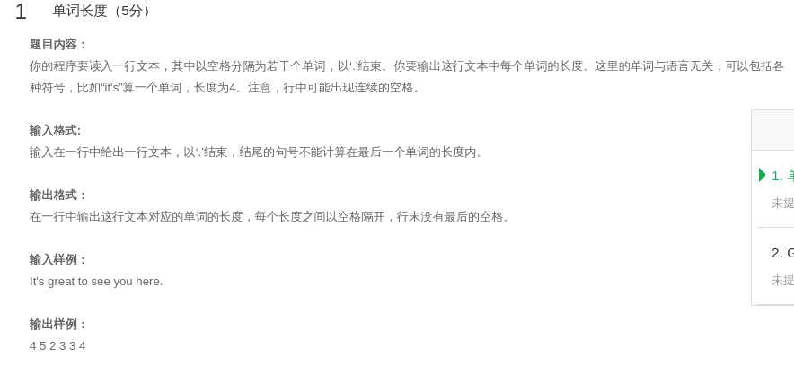

# keri寒假自学java
这是keri从2021/1/22建立的仓库，用来记录寒假自学java语言的过程，计划一天一提交，直到开学为止。  
目前在学慕课上的java零基础课程：[链接](https://www.icourse163.org/learn/ZJU-1001541001?tid=1450243457#/learn/announce)  

> 目录
<!-- TOC -->

- [keri寒假自学java](#keri%E5%AF%92%E5%81%87%E8%87%AA%E5%AD%A6java)
    - [Day1: 计算](#day1-%E8%AE%A1%E7%AE%97)
        - [Day1编程题：](#day1%E7%BC%96%E7%A8%8B%E9%A2%98)
    - [Day2: 判断](#day2-%E5%88%A4%E6%96%AD)
        - [Day2编程题](#day2%E7%BC%96%E7%A8%8B%E9%A2%98)
    - [Day3: 循环](#day3-%E5%BE%AA%E7%8E%AF)
        - [Day3编程题](#day3%E7%BC%96%E7%A8%8B%E9%A2%98)
    - [Day4： 循环控制](#day4-%E5%BE%AA%E7%8E%AF%E6%8E%A7%E5%88%B6)
        - [Day4编程题](#day4%E7%BC%96%E7%A8%8B%E9%A2%98)
    - [Day5: 没学习](#day5-%E6%B2%A1%E5%AD%A6%E4%B9%A0)
    - [Day6： 数组](#day6-%E6%95%B0%E7%BB%84)
        - [day6编程题](#day6%E7%BC%96%E7%A8%8B%E9%A2%98)
    - [Day7： 使用对象](#day7-%E4%BD%BF%E7%94%A8%E5%AF%B9%E8%B1%A1)
        - [Day7编程题](#day7%E7%BC%96%E7%A8%8B%E9%A2%98)
    - [day8](#day8)

<!-- /TOC -->
> 内容
## Day1: 计算
- java的初学者ide是eclipse,本人使用archlinux,安装方法为yay -S jdk8-openjdk eclipse-jee,java环境为openjdk-8,Mac和Windows从官网可下载java和ide；
- 用eclipse去写第一个java程序——helloWorld，新建项目之后，右击src文件夹，新建class类，勾选下面第一个[public......]选项，目前作用不知，以后知道的话会记录；
- ide的自动补全，不会自己跳出来，需要你去按下ALT+/，之后上下选择，回车确定，System.out.println("helloWorld");用println是输出后自动换行，点击上面绿色播放按钮编译运行软件，可以事先按下CTRL+S保存下，之后console栏会输出结果；
- helloworld完成，我们学习java的输入，Scanner in = new Scaner（System.in），注意当你补全Scanner时要注意选择util相关的那个，随后会自动生成import java.util.Scanner；之后我们可以看下输入的内容有没有被读取到，System.out.println（“echo：” + in.nextLine（））；返回的内容就是echo：加上你输入的内容；
- 选择多行的操作，按下SHIFT的同时按方向键；多行加注释的方法，选中多行后，按CTRL+/，去掉注释也是同样的按键；
- 接下来看下System.out.println（2+3+“=2+3=”+（2+3））；的结果是?	5=2+3=5	这就是计算优先级所导致的，注意后面的2+3如果不加括号，那么就是23；
- 赋值操作：int price=0；price=in.nextInt（）；同样如果输入是一个浮点型就用nextFloat（）；in作为一个读取工具可以多次赋值，比如int price=0,count=0；price=in.nextInt（）；count=in.nextInt（）；在console栏可以输入一个之后按空格、回车、制表键等，第一个输入的数字就被赋值到了price,第二个到了count，in在使用完毕后要close掉；
- java 定义常量： final int amount=100；之后不能更改；
- 整型和整型运算，结果只有整型，是不完整的，只要有一个变量是浮点型，那么结果也是浮点型，比如12变成12.0；整型变量赋值给浮点型变量不会出现问题，而浮点型便来嗯赋值给整型变量就要做强制转换，并且会有数据丢失；
- 浮点数运算有误差，因为浮点数在存储时的复杂方法，我们一般用整型运算。
- 单目运算的优先级最高（是指只有一个算子的运算，比如正号和负号），赋值的优先级最低，他们的运算顺序都是从左往右；（乘除、取余）和(加减、字符窜连接的“+”）依次；

### Day1编程题：

```java
import java.util.Scanner;

public class Main {

	public static void main(String[] args) {
		Scanner in = new Scanner(System.in);
		int temperature = 0;
		System.out.print("请输入需要转换的华氏温度：");
		temperature = in.nextInt();
		System.out.println((int)((temperature-32)/1.8));
		in.close();
	}
}
```

## Day2: 判断
- 关系运算就不记录了，所有编程语言都通用，运算级较低，但是比赋值高，其中==和！=优先级比其他运算更低，运算顺序从左往右；
- 判断两个浮点数是否相等，用两个数的差值的绝对值是否小于一个很小的数字，比如：Math.abs（a-b）< 1e-6；
- 条件判断语句，如果只有一句执行语句，那么可以不要大括号；
- 设置断点，用debug模式；双击一行的左侧，出现蓝色点，然后点击那个虫子，就是debug模式，按下F6一行一行执行，按下右上角的java布局，回到正常编辑模式；
- else总是和最近的if匹配；可以用大括号逻辑上分割开；
- 如果else if过多，可以用switch-case：switch（a）{case 1：。。。；case 2：。。。default：。。。}，break跳出匹配；
- 常见错误：

| 编号 | 常见错误 |
| ---- | ---- |
| 1 | 两行以上执行语句，没有加大括号； |
| 2 | if后面直接加了分号，导致大括号内容无关判断语句一直都执行； |
| 3  |判等时，只用一个=； |

### Day2编程题

```java
:import java.util.Scanner;

public class Main {

	public static void main(String[] args) {
		Scanner in = new Scanner(System.in);
		int rs=0,r=0,s=0;
		StringBuffer report=new StringBuffer("");
		System.out.print("输入整数:");
		rs=in.nextInt();
		r=rs/10;
		s=rs%10;
		//System.out.print(r+" "+s);
		switch(s) {
		case 1:report.append("Faint signals, barely perceptible,");
		break;
		case 2:report.append("Very weak signals,");
		break;
		case 3:report.append("Weak signals,");
		break;
		case 4:report.append("Fair signals,");
		break;
		case 5:report.append("Fairly good signals,");
		break;
		case 6:report.append("Good signals,");
		break;
		case 7:report.append("Moderately strong signals,");
		break;
		case 8:report.append("Strong signals,");
		break;
		case 9:report.append("Extremely strong signals,");
		break;
		}
		switch(r) {
		case 1:report.append("unreadable.");
		break;
		case 2:report.append("barely readable, occasional words distinguishable.");
		break;
		case 3:report.append("readable with considerable difficulty.");
		break;
		case 4:report.append("readable with practically no difficulty.");
		break;
		case 5:report.append("perfectly readable.");
		break;
		}
		System.out.print(report);
		in.close();
	}
}
```

```java
import java.util.Scanner;

public class Main {

	public static void main(String[] args) {
		Scanner in = new Scanner(System.in);
		int bjt = 0,utc =0;
		System.out.print("请输入需要转换的北京时间：");
		bjt = in.nextInt();
		if(bjt>=0&&bjt<=2359)
		{
			if(bjt/800>0)
			{
				//utc=(bjt/100-8)*100+bjt%100;//我就是个傻逼，搞这么复杂
				utc=bjt-800;
			}
			else
			{
				utc=bjt+2400-800;//这边吸取了前面经验，没搞那么复杂
			}
			System.out.println(utc);
		}
		else
			System.out.print("输入时间超出大小！");
		in.close();
	}
}
```

## Day3: 循环
- 为了保持缩进，当需要在已有的代码外面，加上新的结构，可以按住`SHIFT`+`方向键`选中多行之后，按下`tab`键，这样选中行的代码部分就会往后移动四格。
- 要想让程序一直循环运行，我们可以在主要功能代码外面加上while（true）{}结构
- 如何写一个知道这个是几位数的算法：  
```java
whie(number>0)
{
	number/=10;
	count+=1;
}
```
- 如何了解上面这个程序中，数值是如何变化的

| 编号 | 方法 |
| ---- | ---- |
| 1 | 人工模拟知道每一步的计算过程 |
| 2| 在while中插入输入语句，每一步执行完之后，输出变量的值 |
| 3 | 在while那一行加上一个断点，利用前面学的debug模式，来知道每次执行完成之后变量的变化 |
- 测试程序可用性，常用边界数据，比如
>1. 有效范围两端的数
>2. 特殊的倍数
>3.  还有比如各位数、10、0、负数
- 比如用小于0的数输入进去，那么计数器不会启动，所以输出是0位数，是有问题的
*解决办法:*用do-while循环，先让功能代码运行一遍，如果运行完成之后，满足条件，继续，否则，结束
**注意**  do-while结构，后面有分号
- java生成随机数，int number=Math.random（）*//生成了一个在[0,1)之间的数*
**注意** 如果我们乘上10那么就是在[0,10)之间的数，以此类推   
如果我们再加上数字“1”，那么就是[1,11),因为是整数，所以范围也是[1,10];   

### Day3编程题

```java
import java.util.Scanner;

public class Main {

	public static void main(String[] args) {
		Scanner in = new Scanner(System.in);
		System.out.print("请输入一系列正整数：（以数字-1结束）");
		int number=0,jishu=0,oushu=0;
		number=in.nextInt();
		while (number!=-1) {
			if(number>100000||number<0)
				System.out.print("不在范围内！");
			if(number%2==0)
				oushu+=1;
			else
				jishu+=1;
			number=in.nextInt();
		}
		System.out.print(jishu+" "+oushu);
		in.close();
	}
}
```

```java
import java.util.Scanner;

public class Main {

	public static void main(String[] args) {
		Scanner in = new Scanner(System.in);
		System.out.print("请输入一个非负整数：");
		int number=in.nextInt(),yushu,tmp=1,count=1,result=0;
		while(number!=0) {
			yushu=number%10;
			number/=10;
			if(yushu%2!=0&&count%2!=0||yushu%2==0&count%2==0)
				result+=tmp;
			tmp*=2;
			count++;
		}
		System.out.print(result);
		in.close();
	}
}
```

## Day4： 循环控制
- int型的表示范围[2^31-1,-2^31],超出会溢出
- 三种循环的选择：
  
| 种类 | when |
| ---- | ---- |
| for | 有固定次数 |
| do-while | 必须先执行一次 |
| while | 其他 |
- 当循环不需要再执行的时候，我们可以用break语句跳出循环；
- 还有continue,是用来继续下一轮循环，而本轮的剩余不会再执行；
- 当是多重循环时，如果break/continue写在里面，只会跳出最里面的循环
解决方法：java有自定义标号，在最外层循环的外面加上`标号：`这样最外层循环就被命名成标号名，下面用break 标号；  
这样就跳出了最外层循环；
- java的逻辑类型，申明：boolean flag=true/false；
- 逻辑运算：与、或、非------>&&、||、！
- 优先级：！> &&>||
- 最大公约数：辗转相除法

### Day4编程题

```java
import java.util.Scanner;

public class Main {

	public static void main(String[] args) {
		Scanner in = new Scanner(System.in);
		System.out.print("请输入两个整数：");
		int n=0,m=0,count=0,sum=0;
		n=in.nextInt();
		m=in.nextInt();
		for(int i=2;i<200;i++) {
			int isPrime=1;
			for(int j=2;j<i;j++) {
				if(i%j==0) {
					isPrime=0;
					break;
				}
			}
			if(isPrime==1) {
				count++;
				if(count>=n&&count<=m)
						sum+=i;
			}
		}
		System.out.print(sum);
		in.close();
	}
}
```

```java
import java.util.Scanner;

public class Main {

	public static void main(String[] args) {
		Scanner in = new Scanner(System.in);
		System.out.print("请输入一个整数：");
		int number=in.nextInt(),o_number=0,count=0;
		if(number<0) {
			number=-number;
			System.out.print("fu ");
		}
		o_number=number;
		do {
			number/=10;
			count++;
		}while(number>0);
		while(count>0) {
			int chushu=(int)Math.pow(10, count-1);
			int flag=o_number/chushu;
			o_number%=chushu;
			switch(flag)
			{
			case 0:System.out.print("ling ");break;
			case 1:System.out.print("yi ");break;
			case 2:System.out.print("er ");break;
			case 3:System.out.print("san ");break;
			case 4:System.out.print("si ");break;
			case 5:System.out.print("wu ");break;
			case 6:System.out.print("liu ");break;
			case 7:System.out.print("qi");break;
			case 8:System.out.print("ba");break;
			case 9:System.out.print("jiu");break;
			default:break;
			}
			count --;
		}
		in.close();
	}
}

```

## Day5: 没学习
> 今天没学java,和同学出去玩了，回家把昨天没写完的`念整数`写完了；  

## Day6： 数组
- 数组的定义：
    int [] number = mew int[100];
- 元素个数必须给，而且是整数，可以是变量，默认全部的值是0；
- 下标越界问题：超出边界，编译器不会检查，但是运行会终止，可以用变量代替常数来解决这个问题
- 定义好后，长度不能改变，number.length可以知道长度
- 如果事先定义好数组a,然后int [] b=a;这时如果我们对b这个数组进行操作，那么数组a也会发生变化，因为a和b只是同时都是那组数据的管理者，不是所有者。
- 如果进行逻辑运算，a==b,除了上面这种情况，输出都是false，即使他们的元素和元素位置完全相同
- 那么该如何进行传统意义上的赋值呢？只能通过遍历的方式进行。
- 那么如何进行判等呢？还是用遍历的方式，如果在长度相等的情况下，有一组数据不等，那么不等，否则，等
- for-each循环
```java
for(int k:data){
......
}
```
- 每一轮循环都会把data里的值拿出来给k,当然data是个数组变量

### day6编程题
  
```java
import java.util.Scanner;

public class Main {
	public static void main(String[] args) {
		Scanner in = new Scanner(System.in);
		System.out.print("请输入两个多项式：");
		int [] a = new int[101];
		int [] b = new int[101];
		int mi=in.nextInt();
		int xishu=in.nextInt();
		while(mi>=0) {
			a[mi]=xishu;
			mi=in.nextInt();
			xishu=in.nextInt();
			if(mi==0) {
				a[0]=xishu;
				mi=in.nextInt();
				xishu=in.nextInt();
				break;
			}
		}
		while(mi>=0) {
			b[mi]=xishu;
			mi=in.nextInt();
			xishu=in.nextInt();
			if(mi==0) {
				b[0]=xishu;
				break;
			}
		}
		for(int i=a.length-1;i>0;i--) {
			if(a[i]!=0||b[i]!=0) {
				System.out.print((a[i]+b[i])+"*"+i+"+");
			}
		}
		if(a[0]!=0||b[0]!=0) {
			System.out.print((a[0]+b[0]));
		}
		in.close();
	}
}
```
## Day7： 使用对象
- 单引号`''`表示单个的字符
- 字符运算char a='A';a++;这是a的值就是B；如果输出'A'-'D',结果就是3,表示距离为3
- 大小写字母在Unicode编码表中是分开顺序排列的，'a'>'Z'，也就是a在Z的后面
- 那么如何实现大小写字母的转换呢？
``` java
//小写转大写
char test1='a';
char test2=(char)(test1+'A'-'a');
System.out.print(test2)
//大写转小写
char test1='A';
char test2=(char)(test1+'a'-'A');
System.out.print(test2)
```
- 逃逸字符  
| \b | 回退一格 | \" |双引号|
|---|---|---|---|
| \t | 下一个制表位 | \' |单引号 |
| \n | 换行 | \\ | 反斜杠本身 |
| \r | 回车 |
- Math 类  
| abs |绝对值 |
|---|---|
|pow|幂次计算 |
|random| 给出0～1之间的随机数|
|round| 四舍五入|
- 在java系统的库中，所有首字母大写的都是类
- 字符串String是个类，是管理者，不是所有者
``` java
String s = new String("a String");
String s = "a String";
```
- 字符串连接
"I am"+"18"->"I am18"
1+2+"age"->"3age"
"age"+1+2->"age12"
"age"+(1+2)->"age3"
- 如何读入字符串，用in.nextline,读入一整行
- 比较字符串是否相等，不用`==`，而是用s.equals("bye");比较s的内容是不是bye,`==`含义是是否是同一个东西
- 比较字符串的大小s1.compareTo(s2),正数表示S1大，0表示相等，-1表示S2大
- 字符串长度获取，s.length
- 访问字符串里字符，s.charAt(i)，i从零开始，到s.length-1;
- 获取子字符串，s.substeing(n)表示从n号位置到末尾，s.substring(b,e)表示从b位置到e位置的字符串，不包括e
- 在字符串中查找字符或字符串，s.indexOf(t),给出t的位置，没有就返回-1,s.indexOf(t,e),从e这个位置开始，查找t,包括e这个位置，s.indexOf("S"),查找字符串的位置
- 字符串不可变，操作都是弄出新的字符串  
### Day7编程题
  
```java
public class Main {
	public static void main(String[] args) {
		Scanner in = new Scanner(System.in);
		System.out.print("请输入一行文本:");
		String s = in.next();;
		while (!(s.equals("."))) {
			if (s.indexOf('.')<0) {
				System.out.print(s.length()+" ");
			}
			else {
				System.out.print(s.length()-1);
				s=".";
			}
			s = in.next();
		}
		in.close();
	}
}
```
## day8: